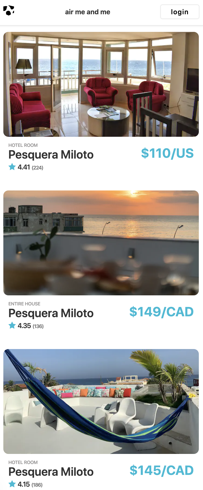

# CPSC1520 Client Side JavaScript

## In Class Assessment 8

For the assessment you're going to use the fetch api to load in a local json file data.json and display the data from the file in the DOM.

## Create Your Application Scope

Create a load event and fetch the data.json file. Create an empty array called store to copy the data from the request so that you have a backup of the data.

```js
window.addEventListener("load", function (e) {
  const rentalRequest = fetch("./js/data.json");
  let store = [];
});
```

## Promise Resolve

Now create .then() method to listen for the request. Use the request.json() method to convert the request data to a usable array of objects in javascript. request.json() returns a promise. The return value of the second promise is the data that makes up the data.json file. Make sure to catch any errors using the catch() method.

```js
window.addEventListener("load", function (e) {
  const rentalRequest = fetch("./js/data.json");
  let store = [];
  rentalRequest
    .then((response) => response.json())
    .then((data) => {
      store = [...data];
    })
    .catch((error) => console.warn(`Error: ${error}`));
});
```

## Creating The Markup

Now inside after you create a copy of the data objects in the data array and spread them into the store create a call to the function createMarkup. This function will return an array of all the rentals marked up.

```js
window.addEventListener("load", function (e) {
  const rentalRequest = fetch("./js/data.json");
  let store = [];
  rentalRequest
    .then((response) => response.json())
    .then((data) => {
      store = [...data];
      const rentals = createMarkup();
    })
    .catch((error) => console.warn(`Error: ${error}`));
});
```

## Create Markup Function

The createMarkup function loops through the store which is an array of objects containing the data for each rental. Map returns an array of new items. These items are held in an array called markup. The markup array is an array of aside elements created from the template. You can find a copy of the template in the index.html file.

imagePath is the relative path to the thumbnail. We create a string that we can use with the img src attribute. Seed the template with data making sure that the data is inserted into the correct slot.

The function returns an array to the function call.

```js
const createMarkup = function () {
  const markup = store.map(function (rental) {
    const imagePath = `./img/thumbnails/${rental.thumbnail}`;
    const template = `           
 
    <aside class="rental">
      
      <header>
        
      </header>
      <ul class="details">
   
        
        <li class="content">
          <div>
            <p class="type">${rental.rentalType}</p>
            <h3 class="location">Pesquera Miloto</h3>
          </div>
          <div class="price">
            <p><span>$${rental.dailyRate}</span><span>/${rental.currency}</span></p>
          </div>
        </li>
        
        <li class="rating">
          
          <span>${rental.rating}</span>
          <span>(${rental.reviews})</span>
         
        </li>
       
      </ul>
    </aside>
             `;
    return document
      .createRange()
      .createContextualFragment(template)
      .querySelector("aside");
  });
  return markup;
};
```

## Displaying Rentals

Immediatly after the createMarkup method call a new function displayRentals. This function will be responsible for adding elements to the DOM.

```js
window.addEventListener("load", function (e) {
  const rentalRequest = fetch("./js/data.json");
  let store = [];
  rentalRequest
    .then((response) => response.json())
    .then((data) => {
      store = [...data];
      const rentals = createMarkup();
      displayRentals(rentals);
    })
    .catch((error) => console.warn(`Error: ${error}`));
});
```  
The function below takes the list of elements and addes them to the display. Inside the html document there is an aside element with the class .display. Select the element from the DOM and add each of the marked up rental aside elements. You now should see your rentals displaying in the browser.
```js
const displayRentals = function(elements){
    elements.forEach(function(rental){
        document.querySelector('.rentals').appendChild(rental)
    })
}
```

## Visual Check
Your file should look similar to the following image at small viewport sizes.

